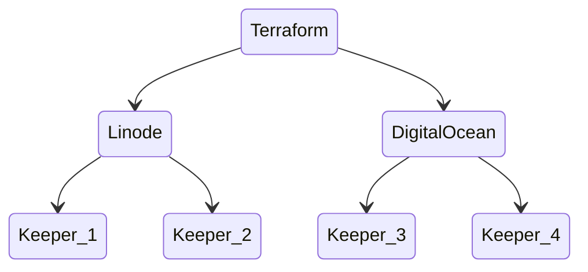
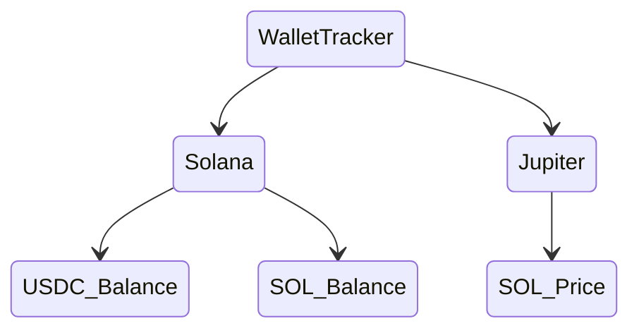
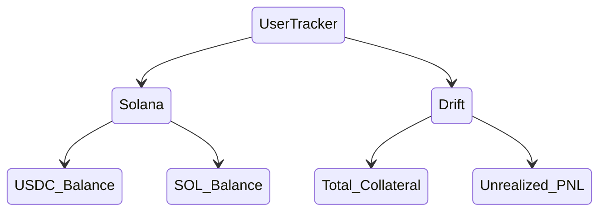
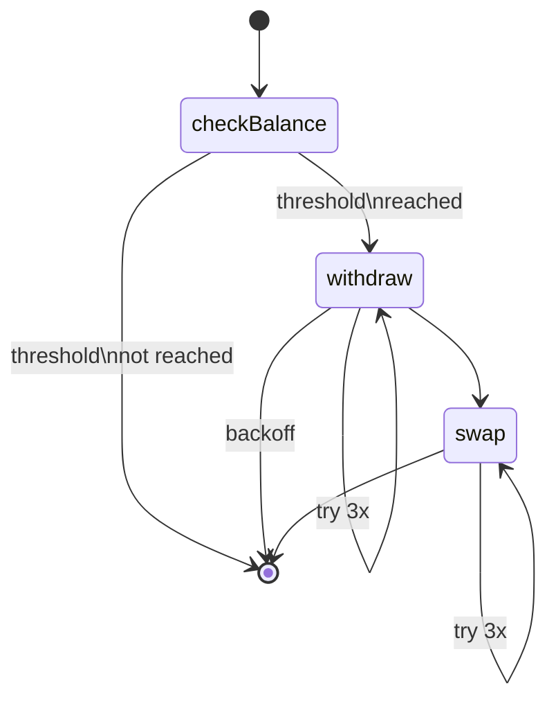
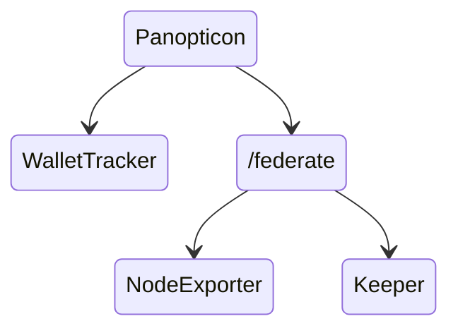

# Drift Keeper Bot

> Keeper Bots in the Drift Protocol keep the protocol operational by performing automated actions as autonomous off-chain agents. Keepers are rewarded depending on the duties that they perform.

This repository contains tools to build, run and monitor Drift Keeper bots on Solana.  
  
More information:
- https://github.com/drift-labs/keeper-bots-v2/
- https://docs.drift.trade/keeper-bots
- https://docs.drift.trade/tutorial-order-matching-bot

---

## Components

This repository contains several components for automation and monitoring of Drift Keeper bots:

- Keeper Bot
- Wallet-Tracker
- User-Tracker
- Auto-Swap
- Panopticon

### Keeper-Bot

The Keeper-Bot is the core component of this whole thing.  
It performs off-chain actions for the Drift Protocol and receives rewards in USDC. A portion of SOL is required to pay for transaction fees.  
While there are several types of bots for Drift, this repository is focused on order matching a.k.a filler bots that tries to match orders in the decentralized orderbook.  
This repository only serves as a build and deploy stack for the official bot of this source repository: https://github.com/drift-labs/keeper-bots-v2/.  



### Wallet-Tracker

As the name suggests, this component tracks the current SOL and USDC onchain balance of a given wallet, as well as the current SOL price from Jupiter.  
Everything is conveniently exportes as Prometheus metrics and will be scraped by the `Panopticon`.




### User-Tracker

This component tracks the current SOL and USDC balance in the wallet as well as total collateral and unrealized PNL on Drift.




### Auto-Swap

The Auto-Swap is resposible of keeping the bot afloat by automatically swapping a portion of the profits to SOL in order to pay for transaction fees.    
It periodically checks if a configurable amount of USDC collateral is available on your Drift account. If this amount is reached,it withdraws all collateral and swaps a configurable portion of the profits to SOL using Jupiter.  
Altough it is possible to configure the swap ratio so that you can make profits in both SOL and USDC. this only seems to work on "slow days". With crazy market fluctuation and high trading volume, consider that you might pay a lot of fees.  



Known problem: when Solana is congested, the autoswap routine fails a lot, as the `withdraw` method seems to be somehow unstable.

### Panopticon

This is basically the monitoring stack consisting of a Prometheus and Grafana instance.  
As every bot is accompanied by a Prometheus instance, the Prometheus of the Panopticon is configured to scrape the `/federate` endpoint of all available instances to centralize monitoring of all servers, bots and wallets.



---

## Prerequisites

- Docker, Docker-Compose
- Solana RPC Endpoint
- Solana Private Key for signing transactions
- Jito Private Key for auth to block engine API (optional)
- Terraform (optional)
- DigitalOcean API Key (optional)
- Linode API Key (optional)

Drift account is setup according to: https://docs.drift.trade/keeper-bots.  
The account can also be set up using the DEX app: https://app.drift.trade/.  

## Build

In order to build all components and push them to the Docker registry, simply run:

```
./ctl.sh build all
./ctl.sh push all
```

## Run Locally

Create .env file from example and configure all environment variables.

```
cp example.env .env
cp example.env.monitoring .env.monitoring
cp example.env.autoswap .env.autoswap
cp example.env.user-metrics .env.user-metrics
```

Adjust `config.yaml` as you please (e.g. configure Jito).  
Then just run the bot.

```
./ctl.sh run
```

## Deploy

Provision DigitalOcean and Linode instances using Terraform.
By default ~/.ssh/id_rsa.pub is added to the root account of each server.

First, create a `values.auto.tfvars` with all your secrets:

```
do_token = "your-token"
linode_token = "your-token"
bot = {
  wallet_address = "your-wallet-address"
  rpc_endpoint = "https://your-endpoint"
  ws_endpoint = "wss://your-ws-endpoint"
  keeper_private_key = "[123,456...789]"
  jito_private_key = "[123,456...789]"
}
monitoring = {
  grafana_user = "admin"
  grafana_password = "grafana"
  prometheus_password = "prompass"
}
```

If you want to configure custom servers, you may also add them to your values file:

```
linode_instances = [
    {
      label                 = "DK-LN-AMS"
      group                 = "keeper"
      image                 = "linode/ubuntu23.10"
      region                = "nl-ams"
      type                  = "g6-standard-1"
      ntp_server            = "ntp.amsterdam.jito.wtf"
      jito_block_engine_url = "amsterdam.mainnet.block-engine.jito.wtf"
      use_jito              = true
    }
]
digitalocean_instances = [
    {
      label                 = "DK-DO-FRA"
      image                 = "ubuntu-23-10-x64"
      region                = "fra1"
      type                  = "s-1vcpu-1gb"
      ntp_server            = "ntp.frankfurt.jito.wtf"
      jito_block_engine_url = "frankfurt.mainnet.block-engine.jito.wtf"
      use_jito              = true
    }
]
```

If no custom instances are provided, the default set from `variables.tf` will be used:
- Linode g6-nanode-1 in Amsterdam (NL)
- Linode g6-nanode-1 in Osaka (JP)
- DigitalOcean s-1vcpu-1gb in Frankfurt (DE)
- DigitalOcean s-1vcpu-1gb in New York (US)

At the time of writing, this setup will cost 22$.

Provision the infrastructure:

```
./ctl.sh infra provision
```

Wait until all instances are up and the `instances` output is printed. You may connect to any server using

```
./ctl.sh infra connect
```

In case somethin went wrong with the provisioning, check the cloud-init-output log at `/var/log/cloud-init-output.log`.

## RPC Providers

In order for Keeper bots to run smoothly, you need to choose a suitable RPC provider that allows all method calls (e.g. getProgramAccounts, etc.).  

Checkout https://solana.com/rpc  

Helius and ExtrNode are quite suitable with reasonable pricing.

## Geo-Locating Nodes

When deploying multiple bots all around the globe, consider placing the machines near your RPC provider and other Solana nodes:
https://solanacompass.com/statistics/decentralization

Keep in mind, not all Linode datacenters support the `Metadata Service` required to apply the cloud-init config. Check the availability here: https://www.linode.com/docs/products/compute/compute-instances/guides/metadata/#availability

## Maintenance

There are several Ansible playbooks to maintain the servers and the app that can be selected and run through the ctl.sh.

```
./ctl.sh infra playbook
```

## Metrics

There are several metrics endpoints available that are periodically scraped by Prometheus:
- http://keeper:9464/metrics
- http://wallet-tracker:3000/metrics
- http://user-tracker:3000/metrics
- http://node-exporter:9100/metrics

A Grafana dashboard is exposed on http://localhost:3000 with default username/password: admin/grafana.
