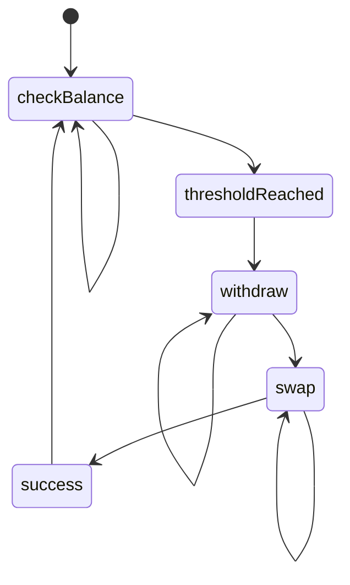

# Auto-Swap



## Configuration

- PRIVATE_KEY: Either use the PRIVATE_KEY or PRIVATE_KEY_FILE variable to set your Solana private key
- SWAP_THRESHOLD: min amount of USDC (considering SWAP_RATION) in Drift account to initiate the swap. Default: 10
- SWAP_RATION: ratio to which the swap should be executed. E.g. 0.5 = 50% of USDC will be swapped to SOL. Default: 0.5
- AUTOSWA_INTERVAL: Time in ms of the interval to check if SWAP_THRESHOLD is reached. Default: 60000

Example: `.env` file:
```
RPC_ENDPOINT=https://your-rpc-endpoint
PRIVATE_KEY="[123,456,...789]"
#PRIVATE_KEY_FILE=~/.config/solana/bot.json
SWAP_THRESHOLD=2
SWAP_RATIO=0.6
AUTOSWAP_INTERVAL=60000
```
